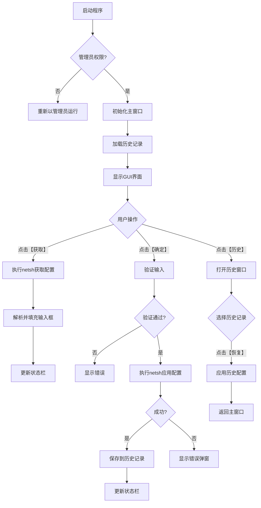

# Windows一键网络配置工具 - 设计文档

## 项目概述
使用Python + tkinter开发Windows网络配置工具，提供图形化界面进行网络参数配置，支持管理员权限自提权、历史记录、异常处理等功能。

## 技术栈选择
- **语言**: Python 3.x
- **GUI框架**: tkinter (内置，无需额外安装)
- **系统交互**: subprocess + netsh命令
- **数据持久化**: JSON
- **打包工具**: PyInstaller (生成单文件exe)

## 程序架构设计

### 1. 主程序结构
```
network_config_tool.py
├── 管理员权限检测与提权
├── 主窗口类 (NetworkConfigGUI)
│   ├── GUI界面初始化
│   ├── 网络配置获取
│   ├── 网络配置应用
│   ├── 历史记录管理
│   └── 日志记录
└── 历史窗口类 (HistoryWindow)
    └── 历史记录展示与恢复
```

### 2. 核心功能模块

#### F1: 图形界面模块
- 主窗口: 400×300像素，屏幕居中
- 输入区域: IP地址、子网掩码/前缀、网关、DNS服务器
- 按钮区域: 【确定】【获取】【历史】
- 状态栏: 底部显示操作结果

#### F2: 网络配置应用模块
- 使用netsh命令序列:
  ```bash
  netsh interface ip set address name="以太网" static <IP> <mask> <gateway>
  netsh interface ip set dns name="以太网" static <DNS>
  ```

#### F3: 网络配置获取模块
- 执行: `netsh interface ip show config name="以太网"`
- 正则表达式解析输出结果
- 自动填充到输入框

#### F4: 历史记录模块
- 使用`collections.deque(maxlen=5)`存储最近5次配置
- 数据结构: `{"ip": "", "mask": "", "gateway": "", "dns": "", "timestamp": ""}`
- 持久化: 同目录`config.json`文件
- 历史窗口: Toplevel弹出窗口

#### F5: 管理员权限模块
- 检测: `ctypes.windll.shell32.IsUserAnAdmin()`
- 提权: `shell.ShellExecuteEx(lpVerb='runas')`

#### F6: 异常处理模块
- 捕获`subprocess.CalledProcessError`
- 错误弹窗提示
- 不回滚历史记录

### 3. 数据流设计



### 4. 错误处理策略

| 错误类型 | 处理方式 | 用户提示 |
|---------|---------|---------|
| 权限不足 | 自动提权或提示 | "需要管理员权限" |
| 输入验证失败 | 阻止执行 | "请输入有效的IP地址" |
| netsh执行失败 | 捕获异常 | "配置失败: 错误详情" |
| 文件读写失败 | 记录日志 | "历史记录保存失败" |

### 5. 日志记录规范

- 日志文件: `network_config.log` (同目录)
- 记录内容: 时间戳、操作类型、结果、错误信息
- 日志级别: INFO(成功操作), ERROR(失败操作)

### 6. 界面布局设计

```
+----------------------------------------+
|        网络配置工具 v1.0               |
+----------------------------------------+
| IP地址:   [________________]          |
| 子网掩码: [________________]          |
| 网关:     [________________]          |
| DNS:      [________________]          |
+----------------------------------------+
|        [确定]  [获取]  [历史]          |
+----------------------------------------+
| 状态: 就绪                              |
+----------------------------------------+
```

### 7. 实现步骤

1. **基础框架**: 创建主窗口和基本布局
2. **权限管理**: 实现管理员检测和提权
3. **网络操作**: 实现配置获取和应用
4. **历史功能**: 实现历史记录存储和恢复
5. **异常处理**: 完善错误处理和日志
6. **界面优化**: 美化界面和用户体验
7. **打包发布**: 使用PyInstaller生成单文件exe

### 8. 依赖库

```python
# 标准库
import tkinter as tk
from tkinter import ttk, messagebox
import subprocess
import re
import json
import logging
from collections import deque
import ctypes
import sys
import os
from datetime import datetime
```

### 9. 配置文件格式

```json
{
  "history": [
    {
      "ip": "192.168.1.100",
      "mask": "255.255.255.0",
      "gateway": "192.168.1.1",
      "dns": "8.8.8.8",
      "timestamp": "2025-11-14 12:00:00"
    }
  ]
}
```

### 10. 打包配置

```bash
# PyInstaller命令
pyinstaller --onefile --windowed --icon=network.ico network_config_tool.py
```

## 注意事项

1. **网络接口名称**: 默认使用"以太网"，可考虑自动检测或配置
2. **输入验证**: 需要验证IP地址、子网掩码的格式正确性
3. **权限处理**: 提权后程序会重启，需要处理参数传递
4. **错误恢复**: netsh失败时不应回滚，避免网络完全中断
5. **用户体验**: 操作完成后应给出明确的成功/失败提示

## 后续优化方向

1. 支持多网卡选择
2. 支持DHCP/静态IP切换
3. 支持配置导出/导入
4. 支持命令行模式
5. 添加配置预览功能